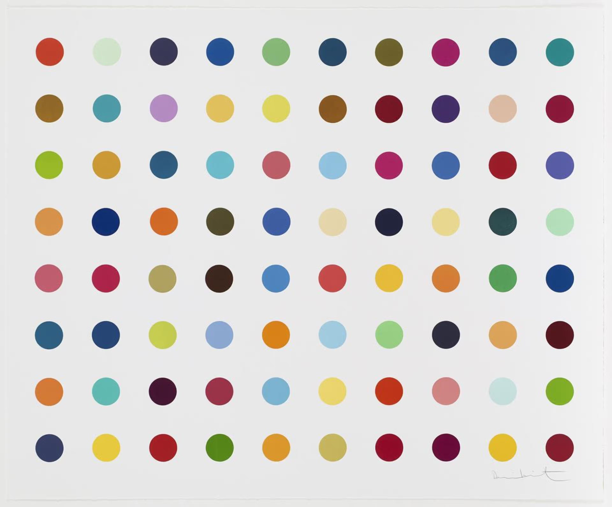

# 🎨 GUI-Based Hirst Painting Project

A Python-based visual recreation of Damien Hirst's dot paintings using the Turtle graphics module. This project is inspired by the "100 Days of Code: Python Bootcamp" by Angela Yu.

## 📷 Preview



## 📌 Features

- Generates a 10x10 grid of colored dots similar to Damien Hirst's iconic artwork.
- Uses Python Turtle for graphical output.
- Extracts color palettes from images using the `colorgram.py` module (optional).

## 🛠 Requirements

- Python 3.9+
- `turtle` (comes pre-installed with Python)
- `colorgram.py` (if you're using dynamic color extraction)

To install `colorgram.py`:
  ```bash
pip install colorgram.py
```
🚀 How to Run
Clone this repository or download the .py file:
```bash
git clone https://github.com/YogeshT22/GUI-Based--The-Hirst-Painting-Project.git
cd GUI-Based--The-Hirst-Painting-Project
```

Run the script:
```bash
python "The Hirst Painting Project.py"
```
- A window will open showing a grid of randomly colored dots, imitating a Hirst-style painting.

🖼 Optional: Extract Colors from an Image
- If you want to use a custom image for the color palette:
- Place the image in the same directory as the script.
- Modify the color extraction section in the code using colorgram.extract('your_image.jpg', number_of_colors).

🔧 Future Improvements
- Add a GUI (Tkinter or PyQt) to select image, grid size, and dot spacing.
- Let users pick color palettes manually or from online sources.
- Export the result as an image file instead of just showing it.

📄 License
- This project is open for educational and personal use. Attribution is appreciated.

🙋‍♂️ Author
- Yogesh T
